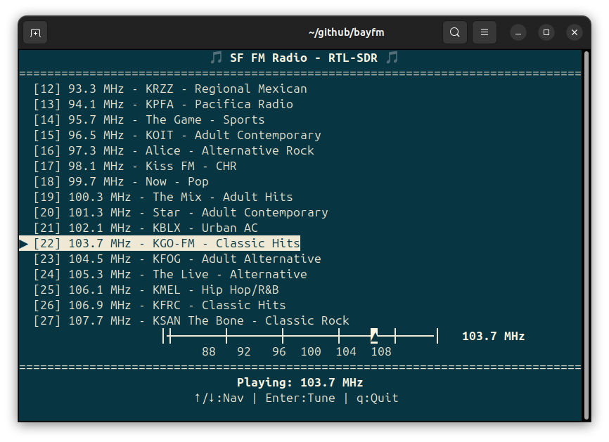

# 🎵 bayfm

**Listen to San Francisco Bay Area radio stations right from your terminal!**

A simple, elegant terminal interface for tuning into local FM radio using a cheap RTL-SDR dongle. Navigate through popular SF Bay Area stations with a visual frequency dial that shows exactly where you are on the FM spectrum.



## ✨ Features

- 🎛️ **Visual frequency dial** - See your current position on the FM band
- 📻 **Curated station list** - Popular SF Bay Area stations pre-configured
- ⌨️ **Easy navigation** - Arrow keys, Enter to tune, number keys for quick access
- 🎯 **One-click tuning** - Just hit Enter to start listening
- 📡 **RTL-SDR powered** - Uses your $20 RTL-SDR dongle

## 🚀 Quick Start

### What You Need
- An RTL-SDR dongle (available for ~$20 on Amazon)
- Linux/macOS with `rtl_fm` and `aplay` installed
- Python 3

### Installation
```bash
# Install RTL-SDR tools (Ubuntu/Debian)
sudo apt install rtl-sdr alsa-utils

# Clone and run
git clone https://github.com/imichaelnorris/bayfm.git
cd bayfm
python3 sf_radio.py
```

### Usage
- **↑/↓ or j/k**: Navigate stations
- **Enter or Space**: Tune to selected station
- **1-9**: Jump directly to station number
- **q**: Quit

## 📻 Included Stations

From jazz (KCSM 91.1) to hip-hop (KMEL 106.1), classical (KDFC 90.3) to indie rock (KALX 90.7) - discover the diverse sounds of the Bay Area!

### 🎯 Customize for Your Region

Not in the Bay Area? No problem! Edit `stations.txt` to add your local stations:

```
# Your Local FM Stations
# Format: frequency,name
88.5,Your Local NPR
92.3,Rock Station
95.7,Pop Music
101.1,Classical FM
```

The app automatically loads stations from `stations.txt` on startup. If the file doesn't exist, it falls back to SF Bay Area stations.

## 🛠️ Requirements

- RTL-SDR dongle
- `rtl_fm` (from rtl-sdr package)
- `aplay` (ALSA audio)
- Python 3 with curses support

---

*Tune in to the Bay Area's radio waves - no internet required!*
